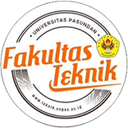

<h1 align="center">Digital Arsip FT UNPAS</h1>

  

  <strong>Sistem Informasi Pengelolaan & Digitalisasi Arsip Dokumen Nilai dan Transkrip Mahasiswa Fakultas Teknik Universitas Pasundan.</strong>

  <a href="https://github.com/aldiipratama/digital-arsip-agy">Repository</a>
  ·
  <a href="https://github.com/aldiipratama/digital-arsip-agy/issues">Report a bug</a>
  ·
  <a href="https://github.com/aldiipratama/digital-arsip-agy/issues">Request a feature</a>

---

> [!IMPORTANT]
> **Catatan Pengembang:** Proyek ini saat ini masih dalam **tahap pengembangan aktif** (*under active development*). Fitur, skema API, dan dokumentasi dapat berubah sewaktu-waktu seiring berlangsungnya proses pengembangan.

---

## Table of Contents

- [About](#about)
- [Features](#features)
- [Built With](#built-with)
- [License](#license)
- [Contributors](#contributors)

---

## About

**Digital Arsip FT UNPAS** adalah platform manajemen pengarsipan digital berbasis web yang dirancang khusus untuk memodernisasi pengelolaan dokumen nilai, transkrip akademik, dan ijazah mahasiswa Fakultas Teknik Universitas Pasundan (angkatan 2000-2010).

Sistem ini membantu memecahkan masalah degradasi arsip fisik kertas, mempercepat pencarian arsip yang dulunya memakan waktu lama, serta menyediakan alur verifikasi dokumen berjenjang berbasis peran (*Role-Based Access Control*) yang transparan dan terukur.

---

## Features

- 🏗️ **Feature-Based Monorepo Architecture**: Pengorganisasian kode bersih terpisah antara Frontend (`apps/dashboard`) dan Backend (`apps/api`) dikelola via Turborepo & pnpm workspace.
- 🔐 **Multi-Role Access Control (RBAC)**: Alur kerja disesuaikan untuk 4 peran pengguna:
  - **Manager Arsip**: Dashboard analitik global, manajemen akun pengguna, log aktivitas, dan laporan statistik.
  - **Quality Control (QC)**: Antrean verifikasi dokumen, persetujuan (*approve*), dan penolakan (*reject*) arsip.
  - **Tim Uploader**: Pengunggahan file PDF arsip, pengisian metadata (Prodi, Matkul, NPM), dan lini masa riwayat upload.
  - **Staff Biro Akademik Pasundan (SBAP)**: Pencarian arsip terverifikasi, pengunduhan file, dan persiapan cetak transkrip.
- 🔍 **Advanced Live Search & Command Palette**: Pencarian arsip cepat berdasarkan nama dokumen, NPM, atau mata kuliah dengan shortcut `Cmd+K` / `Ctrl+K`.
- 📑 **Direct PDF Viewer & Secure Download**: Pratinjau dokumen PDF langsung di browser tanpa berpindah halaman dan pengunduhan aman via blob streaming.
- 📊 **Monitoring & Audit Logs**: Tracking kronologis aktivitas pengguna serta grafik distribusi dokumen berbasis Recharts.

---

## Built With

  
  
  
  
  
  
  
  
  

---

## License

Distributed under the MIT License. See [LICENSE](LICENSE) for more information.

---

## Contributors

| | CONTRIBUTORS | |
| :---: | :---: | :---: |
|  |  |  |

---

Project Link: [https://github.com/Fakultas-Teknik-Universitas-Pasundan/digitalisasi-arsip](https://github.com/Fakultas-Teknik-Universitas-Pasundan/digitalisasi-arsip)
