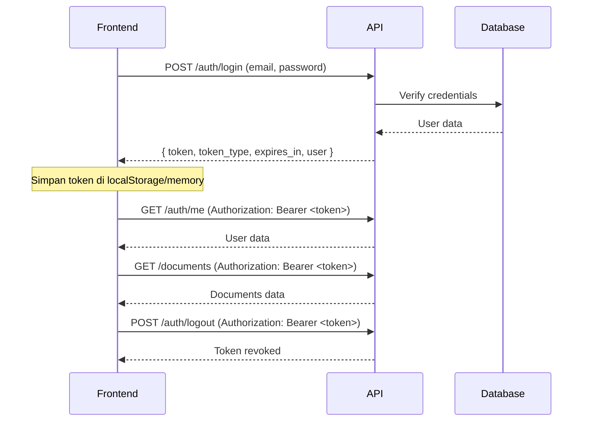

# Laravel Sanctum Token-Based API - Frontend Integration Guide

## Overview

API ini menggunakan **Laravel Sanctum Token-Based Authentication** dengan **Bearer Token**. Ini adalah pendekatan stateless yang cocok untuk cross-domain SPA, mobile apps, dan third-party integrations.

## Architecture



## Key Concepts

### 1. Bearer Token

- Token diberikan saat login, dikirim via `Authorization` header
- Tidak menggunakan cookies atau session
- Setiap request harus menyertakan token

### 2. Stateless API

- Server tidak menyimpan session
- Semua informasi auth ada di token
- Cross-domain friendly — tidak ada masalah CORS cookies

### 3. Token Lifecycle

- **Created:** Saat login berhasil
- **Expires:** Setelah 24 jam (configurable)
- **Revoked:** Saat logout atau logout-all

---

## Setup Instructions

### Step 1: Configure Axios/Fetch

#### Using Axios (Recommended)

```javascript
import axios from "axios";

const api = axios.create({
    baseURL: "http://localhost:8000/api",
    headers: {
        Accept: "application/json",
        "Content-Type": "application/json",
    },
});

// Interceptor untuk auto-include Bearer Token
api.interceptors.request.use((config) => {
    const token = localStorage.getItem("auth_token");
    if (token) {
        config.headers["Authorization"] = `Bearer ${token}`;
    }
    return config;
});

// Interceptor untuk handle 401 (token expired/invalid)
api.interceptors.response.use(
    (response) => response,
    (error) => {
        if (error.response?.status === 401) {
            localStorage.removeItem("auth_token");
            window.location.href = "/login";
        }
        return Promise.reject(error);
    },
);

export default api;
```

#### Using Fetch

```javascript
// Helper for authenticated fetch
async function apiFetch(url, options = {}) {
    const token = localStorage.getItem("auth_token");

    const response = await fetch(`http://localhost:8000/api${url}`, {
        ...options,
        headers: {
            Accept: "application/json",
            "Content-Type": "application/json",
            ...(token ? { Authorization: `Bearer ${token}` } : {}),
            ...options.headers,
        },
    });

    if (response.status === 401) {
        localStorage.removeItem("auth_token");
        window.location.href = "/login";
    }

    return response;
}
```

---

### Step 2: Login Flow

```javascript
// Login — mendapat Bearer Token
async function login(email, password) {
    try {
        const response = await api.post("/auth/login", { email, password });

        const { token, token_type, expires_in } = response.data.data;

        // Simpan token
        localStorage.setItem("auth_token", token);

        // Optional: simpan expiration time
        const expiresAt = Date.now() + expires_in * 1000;
        localStorage.setItem("token_expires_at", expiresAt);

        console.log("Login berhasil:", response.data.data.user);
        return response.data;
    } catch (error) {
        console.error("Login gagal:", error.response?.data);
        throw error;
    }
}

// Check if authenticated
async function getCurrentUser() {
    try {
        const response = await api.get("/auth/me");
        return response.data.data;
    } catch (error) {
        return null; // Not authenticated
    }
}

// Logout (current device)
async function logout() {
    try {
        await api.post("/auth/logout");
    } catch (error) {
        console.error("Logout error:", error);
    } finally {
        localStorage.removeItem("auth_token");
        localStorage.removeItem("token_expires_at");
    }
}

// Logout all devices
async function logoutAll() {
    try {
        await api.post("/auth/logout-all");
    } catch (error) {
        console.error("Logout all error:", error);
    } finally {
        localStorage.removeItem("auth_token");
        localStorage.removeItem("token_expires_at");
    }
}
```

---

### Step 3: Making Authenticated Requests

```javascript
// Semua request authenticated via Authorization header (auto by interceptor)

// Get documents
async function getDocuments(params = {}) {
    const response = await api.get("/documents", { params });
    return response.data;
}

// Upload document
async function uploadDocument(formData) {
    const response = await api.post("/documents", formData, {
        headers: { "Content-Type": "multipart/form-data" },
    });
    return response.data;
}

// Get users (manager only)
async function getUsers(params = {}) {
    const response = await api.get("/users", { params });
    return response.data;
}
```

---

## Environment Variables

### Backend (.env)

```env
APP_URL=http://localhost:8000

# Token expiration in minutes (default: 1440 = 24 hours)
SANCTUM_TOKEN_EXPIRATION=1440

# CORS - allowed frontend origins
CORS_ALLOWED_ORIGINS=http://localhost:3000
```

### Frontend (.env)

```env
VITE_API_URL=http://localhost:8000/api
```

---

## Login Response Format

```json
{
    "message": "Login berhasil.",
    "data": {
        "user": {
            "id": 1,
            "name": "Admin Manager",
            "email": "manager@example.com",
            "role": "manager"
        },
        "token": "1|abc123def456...",
        "token_type": "Bearer",
        "expires_in": 86400
    }
}
```

---

## Troubleshooting

### Issue: "Unauthenticated" on protected routes

**Solution:**

1. Pastikan header `Authorization: Bearer <token>` disertakan
2. Cek apakah token sudah expired (24 jam)
3. Cek apakah token sudah di-revoke (logout)

### Issue: CORS errors

**Solution:**

1. Pastikan `CORS_ALLOWED_ORIGINS` di backend `.env` include domain frontend
2. Check `config/cors.php`

### Issue: Token expired

**Solution:**

1. Implement auto-refresh: redirect ke login page saat 401
2. Simpan `expires_in` dan cek sebelum request

---

## Security Best Practices

1. ✅ Always use HTTPS in production
2. ✅ Store token securely (httpOnly cookie or secure storage)
3. ✅ Implement token expiration check on frontend
4. ✅ Handle 401 responses gracefully (redirect to login)
5. ✅ Use `logout-all` for security emergencies
6. ✅ Don't expose token in URLs or logs

---

## Migration Checklist for Frontend (dari Cookie ke Token)

- [ ] Hapus `withCredentials: true` dari axios config
- [ ] Hapus CSRF cookie request (`/csrf-cookie`)
- [ ] Hapus header `X-XSRF-TOKEN` dari requests
- [ ] Tambah interceptor untuk `Authorization: Bearer <token>`
- [ ] Simpan token dari login response ke localStorage
- [ ] Handle 401 response (redirect ke login)
- [ ] Implementasi `logout-all` di UI (opsional)
- [ ] Test login → authenticated request → logout flow

---

## Benefits (Token vs Cookie)

| Aspect       |   Cookie (Before)    |    Token (Now)     |
| ------------ | :------------------: | :----------------: |
| Cross-Domain |     ❌ Kompleks      |     ✅ Simple      |
| Mobile App   |       ❌ Sulit       |      ✅ Mudah      |
| Stateless    | ❌ Session di server | ✅ Fully stateless |
| CSRF         |    ❌ Perlu token    |   ✅ Tidak perlu   |
| Multi-Device |     ❌ 1 session     | ✅ Multiple tokens |
