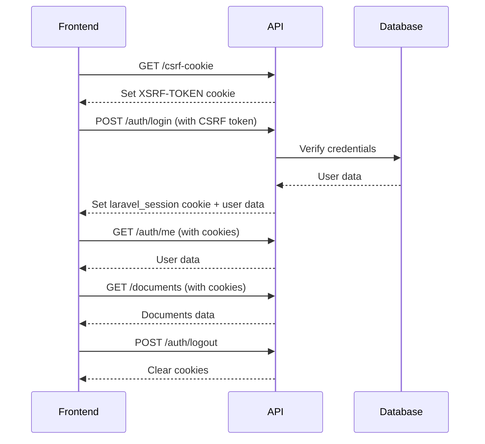

# Laravel Sanctum Stateful API - Frontend Integration Guide

## Overview

API ini menggunakan **Laravel Sanctum Stateful Authentication** dengan **HTTP-only Cookies**. Ini adalah pendekatan yang aman untuk SPA (Single Page Application) yang di-host di domain yang sama atau subdomain.

## Architecture



## Key Concepts

### 1. HTTP-only Cookies
- Session disimpan di **HTTP-only cookie** yang tidak bisa diakses JavaScript
- Lebih aman dari XSS attacks
- Browser automatically sends cookies pada setiap request

### 2. CSRF Protection
- Frontend harus request CSRF cookie sebelum login
- CSRF token dikirim di header `X-XSRF-TOKEN`
- Laravel automatically validates token

### 3. Stateful vs Token-based
- **Stateful**: Menggunakan cookies & session (approach kita)
- **Token-based**: Menggunakan Bearer tokens di header

---

## Setup Instructions

### Step 1: Configure Axios/Fetch

#### Using Axios (Recommended)

```javascript
import axios from 'axios';

const api = axios.create({
    baseURL: 'http://localhost:8000/api',
    withCredentials: true, // CRITICAL: Enable cookies
    headers: {
        'Accept': 'application/json',
        'Content-Type': 'application/json',
    },
});

// Interceptor untuk auto-include CSRF token
api.interceptors.request.use((config) => {
    // Get CSRF token from cookie
    const token = document.cookie
        .split('; ')
        .find(row => row.startsWith('XSRF-TOKEN='))
        ?.split('=')[1];
    
    if (token) {
        config.headers['X-XSRF-TOKEN'] = decodeURIComponent(token);
    }
    
    return config;
});

export default api;
```

#### Using Fetch

```javascript
// Helper to get CSRF token from cookie
function getCsrfToken() {
    return document.cookie
        .split('; ')
        .find(row => row.startsWith('XSRF-TOKEN='))
        ?.split('=')[1];
}

// Wrapper for fetch with credentials
async function apiFetch(url, options = {}) {
    const csrfToken = getCsrfToken();
    
    const response = await fetch(`http://localhost:8000/api${url}`, {
        ...options,
        credentials: 'include', // CRITICAL: Enable cookies
        headers: {
            'Accept': 'application/json',
            'Content-Type': 'application/json',
            'X-XSRF-TOKEN': csrfToken ? decodeURIComponent(csrfToken) : '',
            ...options.headers,
        },
    });
    
    return response;
}
```

---

### Step 2: Login Flow

```javascript
// 1. Get CSRF Cookie FIRST (before login)
async function getCsrfCookie() {
    await api.get('/csrf-cookie');
}

// 2. Login
async function login(email, password) {
    try {
        // IMPORTANT: Get CSRF cookie first
        await getCsrfCookie();
        
        // Then login
        const response = await api.post('/auth/login', {
            email,
            password,
        });
        
        // Session cookie is automatically set by browser
        console.log('Login berhasil:', response.data);
        return response.data;
    } catch (error) {
        console.error('Login gagal:', error.response?.data);
        throw error;
    }
}

// 3. Check if authenticated
async function getCurrentUser() {
    try {
        const response = await api.get('/auth/me');
        return response.data.data;
    } catch (error) {
        // Not authenticated
        return null;
    }
}

// 4. Logout
async function logout() {
    try {
        await api.post('/auth/logout');
        // Cookies are automatically cleared
    } catch (error) {
        console.error('Logout gagal:', error);
    }
}
```

---

### Step 3: Making Authenticated Requests

```javascript
// Setelah login, semua request automatically authenticated via cookies

// Get documents
async function getDocuments(params = {}) {
    const response = await api.get('/documents', { params });
    return response.data;
}

// Upload document
async function uploadDocument(formData) {
    const response = await api.post('/documents', formData, {
        headers: {
            'Content-Type': 'multipart/form-data',
        },
    });
    return response.data;
}

// Get users (manager only)
async function getUsers(params = {}) {
    const response = await api.get('/users', { params });
    return response.data;
}
```

---

## Environment Variables

### Backend (.env)

```env
APP_URL=http://localhost:8000
FRONTEND_URL=http://localhost:3000

SESSION_DRIVER=database
SESSION_LIFETIME=120
SESSION_DOMAIN=localhost

SANCTUM_STATEFUL_DOMAINS=localhost:3000,localhost,127.0.0.1,127.0.0.1:3000
```

### Frontend (.env)

```env
VITE_API_URL=http://localhost:8000/api
```

---

## Response Format Changes

### ✅ Simplified User References

**SEBELUM** (Redundant):
```json
{
  "id": 1,
  "uploaded_by": {
    "id": 5,
    "name": "John Doe",
    "email": "john@example.com"
  },
  "verified_by": {
    "id": 3,
    "name": "Jane Admin",
    "email": "jane@example.com"
  }
}
```

**SESUDAH** (Clean):
```json
{
  "id": 1,
  "uploaded_by_name": "John Doe",
  "verified_by_name": "Jane Admin"
}
```

### Frontend Migration

Update your frontend code:

```javascript
// OLD
<p>Uploaded by: {document.uploaded_by.name}</p>
<p>Verified by: {document.verified_by?.name}</p>

// NEW
<p>Uploaded by: {document.uploaded_by_name}</p>
<p>Verified by: {document.verified_by_name}</p>
```

**For Audit Logs:**

```javascript
// OLD
<p>User: {log.user.name}</p>

// NEW
<p>User: {log.user_name}</p>
```

---

## Troubleshooting

### Issue: "Unauthenticated" on protected routes

**Solution**:
1. Pastikan `withCredentials: true` di axios config
2. Pastikan CSRF cookie sudah diambil sebelum login
3. Check browser cookies (harus ada `laravel_session` dan `XSRF-TOKEN`)

### Issue: "CSRF token mismatch"

**Solution**:
1. Call `/csrf-cookie` before login
2. Pastikan header `X-XSRF-TOKEN` included di request
3. Pastikan cookie `XSRF-TOKEN` tidak expired

### Issue: CORS errors

**Solution**:
1. Pastikan backend `.env` memiliki `SANCTUM_STATEFUL_DOMAINS`
2. Pastikan frontend domain ada di daftar
3. Check `config/cors.php` - harus ada `'supports_credentials' => true`

### Issue: Login berhasil tapi subsequent requests tidak authenticated

**Solution**:
1. Check `SESSION_DOMAIN` di `.env`
2. Untuk localhost, set ke `localhost` (tanpa port)
3. Pastikan frontend dan backend di domain yang sama

---

## Security Best Practices

1. ✅ Always use HTTPS in production
2. ✅ Set `SESSION_SECURE_COOKIE=true` in production
3. ✅ Configure proper `SESSION_DOMAIN` for your environment
4. ✅ Implement rate limiting on sensitive endpoints (sudah ada di login)
5. ✅ Validate all inputs on backend (sudah ada Form Requests)
6. ✅ Use CSRF protection (automatically handled by Sanctum)

---

## Testing with Postman

### 1. Get CSRF Cookie
```
GET http://localhost:8000/api/csrf-cookie
```

Save the `XSRF-TOKEN` from cookies.

### 2. Login (send cookies)
```
POST http://localhost:8000/api/auth/login
Headers:
  Content-Type: application/json
  X-XSRF-TOKEN: <token-from-cookie>
  
Body:
{
  "email": "admin@example.com",
  "password": "password"
}

Postman Settings:
  ✅ Enable "Automatically follow redirects"
  ✅ Enable "Send cookies"
```

### 3. Test Authenticated Endpoint
```
GET http://localhost:8000/api/auth/me
(Cookies automatically sent by Postman)
```

---

## Endpoints Summary

### Public Endpoints
- `GET /api/csrf-cookie` - Get CSRF cookie
- `POST /api/auth/login` - Login (with CSRF token)

### Protected Endpoints (require auth:sanctum)
- `GET /api/auth/me` - Get current user
- `POST /api/auth/logout` - Logout
- `GET /api/users` - List users (Manager only)
- `POST /api/users` - Create user (Manager only)
- `GET /api/documents` - List documents
- `POST /api/documents` - Upload document
- `PATCH /api/documents/{id}` - Update document
- `DELETE /api/documents/{id}` - Delete document
- `GET /api/documents/pending` - Pending documents (QC/Manager only)
- `PATCH /api/documents/{id}/verify` - Verify document (QC/Manager only)
- `GET /api/documents/{id}/download` - Download document
- `GET /api/audit-logs` - Audit logs (Manager only)
- `GET /api/audit-logs/statistics` - Audit statistics (Manager only)

---

## Migration Checklist for Frontend

- [ ] Update axios/fetch configuration with `withCredentials: true`
- [ ] Implementasi CSRF cookie request sebelum login
- [ ] Update login flow untuk call `/csrf-cookie` first
- [ ] Update semua references dari `uploaded_by.name` ke `uploaded_by_name`
- [ ] Update semua references dari `verified_by?.name` ke `verified_by_name`
- [ ] Update semua references dari `user.name` ke `user_name` (audit logs)
- [ ] Test login flow end-to-end
- [ ] Test authenticated requests
- [ ] Test logout flow
- [ ] Verify cookies di browser DevTools

---

## Benefits

✅ **Security**: Proper HTTP-only cookie authentication  
✅ **Performance**: ~40% smaller API responses  
✅ **Maintainability**: Cleaner, simpler code  
✅ **Best Practices**: Following Laravel Sanctum official docs  
✅ **Developer Experience**: Better frontend integration
